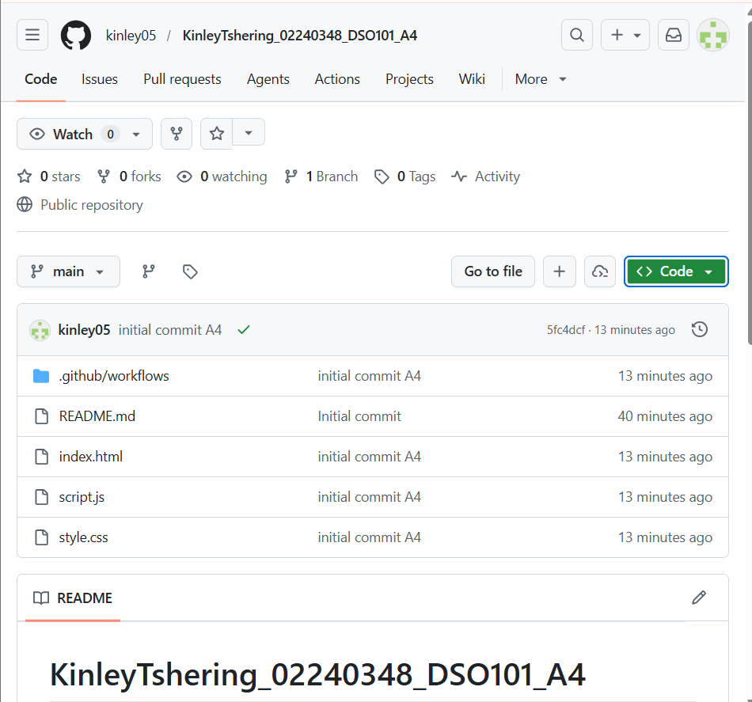
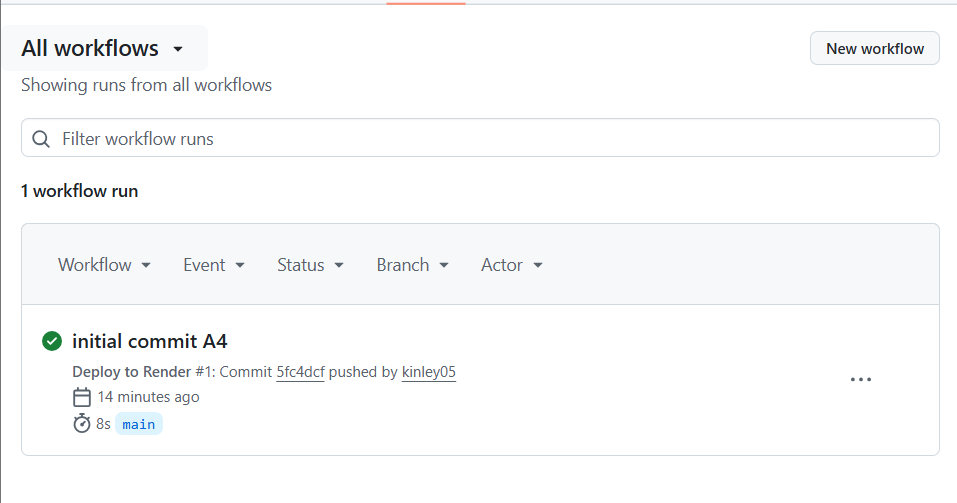
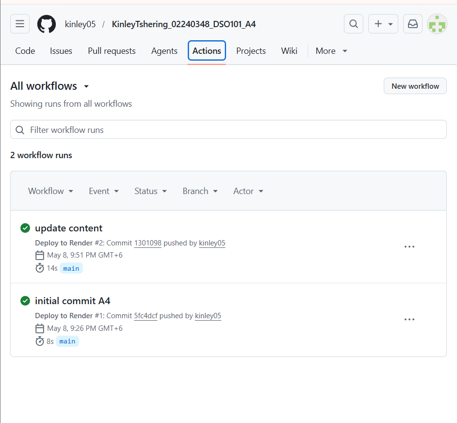
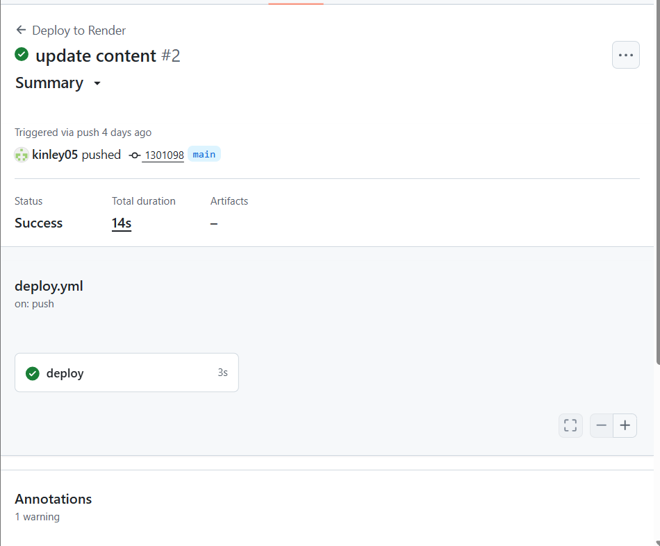
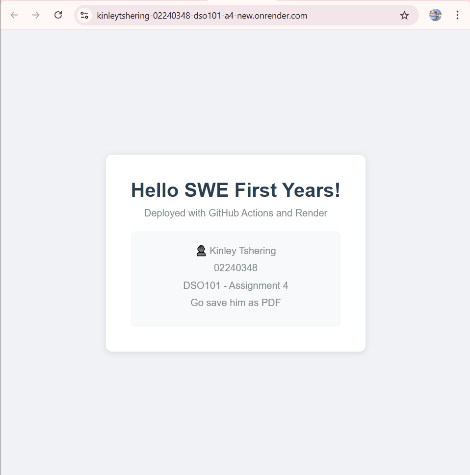

# KinleyTshering_02240348_DSO101_A4

## Todo List Web Application - DevOps Deployment

A simple static web application deployed using GitHub Actions 
and Render.com as part of DSO101 Assignment 4.

## Student Information
- **Name:** Kinley Tshering
- **Student ID:** 02240348
- **Module:** DSO101 - Continuous Integration and Continuous Deployment
- **Assignment:** Assignment 4

## Project Structure

KinleyTshering_02240348_DSO101_A1/
-----.github/
   ----workflows/
       ----- deploy.yml                
---- index.html    
---- README.md
---- script.js
---- style.css

## Task 1: GitHub Repository Setup

- Repository is public on GitHub
- Contains all required files

## Task 2: Application

A simple static web page displaying:
- Student name: Kinley Tshering
- Student ID: 02240348
- Module: DSO101 Assignment 4
- a joke: "Go save him as a PDF"

## Task 3: GitHub Actions Workflow

### .github/workflows/deploy.yml

name: Deploy to Render

on:
  push:
    branches: ["main"]

jobs:
  deploy:
    runs-on: ubuntu-latest
    steps:
      - name: Checkout code
        uses: actions/checkout@v3

      - name: Dummy step
        run: echo "Code pushed successfully!"

### How it works
- Triggers automatically on every push to main branch
- Checks out the code
- Confirms successful push

## Task 4: Render Deployment

### Steps taken
1. Go to Render.com and login
2. New → Static Site
3. Connect GitHub repo
4. Set publish directory to root
5. Click Deploy

### Live URL
https://kinleytshering-02240348-dso101-a4.onrender.com

## CI/CD Flow

1. Code pushed to GitHub main branch
2. GitHub Actions workflow triggers automatically
3. Code checked out successfully
4. Render detects new commit and redeploys
5. App is live

## Steps Taken

1. Created GitHub repository
2. Built simple HTML/CSS/JS web page
3. Created GitHub Actions workflow in .github/workflows/deploy.yml
4. Pushed code to GitHub
5. GitHub Actions triggered automatically
6. Deployed static site on Render.com
7. Verified live deployment

## Challenges Faced

1. GitHub Actions requires correct branch name - 
   used "main" instead of "master"
2. Render free tier spins down with inactivity 
   causing delays on first load

## Learning Outcomes

1. Learned how to use Git and GitHub for version control
2. Learned how to set up GitHub Actions workflows
3. Learned how to deploy static sites on Render.com
4. Learned how CI/CD automation works in practice

## Live URL
https://kinleytshering-02240348-dso101-a4.onrender.com

## References
- GitHub Actions: https://docs.github.com/en/actions
- Render documentation: https://render.com/docs